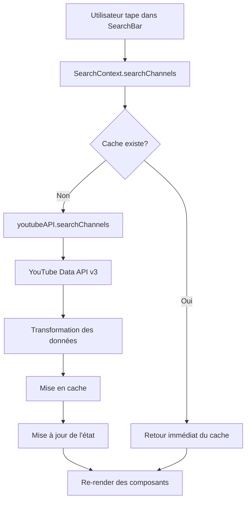
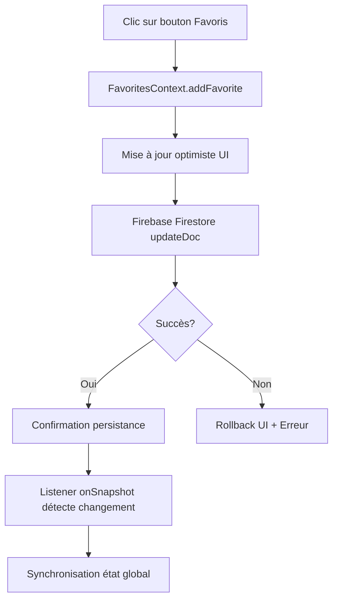
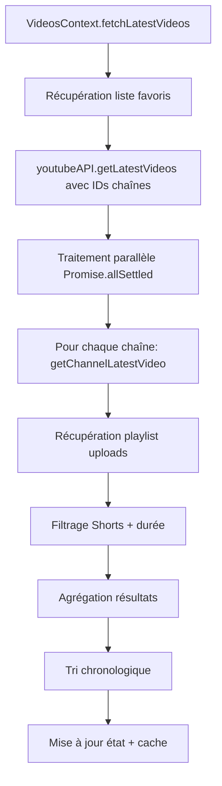

# 🔧 GUIDE TECHNIQUE YOURFEED - ARCHITECTURE & FONCTIONNEMENT

## 📋 TABLE DES MATIÈRES

1. [Vue d'ensemble de l'application](#vue-densemble)
2. [Architecture frontend](#architecture-frontend)
3. [Services et APIs](#services-et-apis)
4. [Backend Firebase](#backend-firebase)
5. [Flux de données](#flux-de-données)
6. [Système de cache](#système-de-cache)
7. [Gestion des erreurs](#gestion-des-erreurs)
8. [Déploiement](#déploiement)
9. [Performances et optimisations](#performances)

---

## 🎯 VUE D'ENSEMBLE {#vue-densemble}

**YourFeed** est une application web moderne de curation de contenu YouTube qui permet aux utilisateurs de :
- Rechercher et suivre leurs chaînes YouTube préférées
- Organiser leurs vidéos par catégories personnalisées 
- Consulter un feed personnalisé des dernières vidéos
- Gérer leurs favoris de manière sécurisée dans le cloud

### **Stack Technologique**
```
Frontend: React 18 + TypeScript + Vite
Styling: Tailwind CSS
Backend: Firebase (Firestore + Auth)
API External: YouTube Data API v3
Cache: SmartCache (mémoire local)
Déploiement: Firebase Hosting
```

---

## 🏗️ ARCHITECTURE FRONTEND {#architecture-frontend}

### **Structure modulaire en couches**

```
src/
├── 📁 contexts/           # État global de l'application
│   ├── AppProvider.tsx    # Provider composite principal
│   ├── AuthContext.tsx    # Authentification utilisateur
│   ├── FavoritesContext.tsx # Gestion des favoris
│   ├── SearchContext.tsx  # Recherche de chaînes
│   ├── VideosContext.tsx  # Gestion des vidéos
│   └── CategoriesContext.tsx # Catégories personnalisées
├── 📁 services/           # Couche de services
│   ├── youtubeAPI.ts      # Interface YouTube API
│   ├── validation.ts      # Validation des données
│   └── transformers.ts    # Transformation des données
├── 📁 components/         # Composants UI réutilisables
├── 📁 utils/              # Utilitaires (cache, errors)
└── 📁 types/             # Définitions TypeScript
```

### **Pattern de contextes spécialisés**

L'application utilise une architecture basée sur des contextes React spécialisés qui gèrent chacun un domaine spécifique :

#### **1. AppProvider - Orchestrateur principal**
```typescript
export const AppProvider = ({ children }) => (
  <AuthProvider>
    <CategoriesProvider>
      <FavoritesProvider>
        <SearchProvider>
          <VideosProvider>
            {children}
          </VideosProvider>
        </SearchProvider>
      </FavoritesProvider>
    </CategoriesProvider>
  </AuthProvider>
);
```

#### **2. AuthContext - Authentification Firebase**
- Gestion de l'état utilisateur (connecté/déconnecté)
- Connexion Google OAuth via Firebase Auth
- Persistance automatique de la session
- Listener temps réel des changements d'état

#### **3. FavoritesContext - Gestion des favoris**
- CRUD des chaînes favorites dans Firestore
- Synchronisation temps réel avec la base de données
- Validation des données avant sauvegarde
- Gestion optimiste des mises à jour

#### **4. SearchContext - Recherche YouTube**
- Interface avec YouTube Data API v3
- Cache intelligent des résultats de recherche
- Debouncing pour optimiser les requêtes
- Gestion des états de chargement et d'erreur

#### **5. VideosContext - Flux de vidéos**
- Agrégation des dernières vidéos des chaînes suivies
- Traitement parallèle des requêtes API
- Filtrage automatique (Shorts, durée minimale)
- Tri chronologique des résultats

---

## 🔌 SERVICES ET APIS {#services-et-apis}

### **YouTube Data API v3 Integration**

#### **Service Principal : `youtubeAPI.ts`**

```typescript
export const youtubeAPI = {
  // Recherche de chaînes
  searchChannels: async (query: string): Promise<Channel[]>
  
  // Détails d'une chaîne
  getChannelDetails: async (channelId: string): Promise<Channel | null>
  
  // Dernière vidéo d'une chaîne (avec filtres)
  getChannelLatestVideo: async (channelId: string): Promise<Video | null>
  
  // Dernières vidéos de plusieurs chaînes (parallèle)
  getLatestVideos: async (channelIds: string[]): Promise<Video[]>
}
```

#### **Optimisations API**

**1. Traitement parallèle**
```typescript
// Au lieu de séquentiel (lent)
for (const channelId of channelIds) {
  const video = await getChannelLatestVideo(channelId);
}

// Traitement parallèle (rapide)
const videoPromises = channelIds.map(id => getChannelLatestVideo(id));
const videos = await Promise.allSettled(videoPromises);
```

**2. Filtres intelligents**
- Exclusion automatique des YouTube Shorts
- Filtrage par durée minimale (> 3 minutes)
- Validation des thumbnails haute qualité
- Gestion des playlists uploads

**3. Gestion d'erreurs robuste**
```typescript
try {
  const response = await fetch(apiUrl);
  if (!response.ok) {
    throw new Error(`API Error: ${response.status}`);
  }
  return response.json();
} catch (error) {
  console.error('[API Error]', error);
  // Fallback ou propagation contrôlée
}
```

---

## 🔥 BACKEND FIREBASE {#backend-firebase}

### **Architecture Firebase**

```
Firebase Project
├── 🔐 Authentication        # Google OAuth
├── 🗄️ Firestore Database    # Données utilisateur
├── 🌐 Hosting              # Application web statique
└── 📋 Security Rules       # Règles de sécurité
```

### **Structure Firestore**

```
📁 Collection: users
  📄 Document: {userId}
    ├── favorites: [channelId1, channelId2, ...]    # IDs des chaînes
    ├── categories: { name: string, channels: [] }   # Catégories custom
    ├── watchedVideos: [videoId1, videoId2, ...]    # Historique
    ├── laterVideos: [videoId1, videoId2, ...]      # À regarder plus tard
    ├── preferences: { theme: 'dark', ... }         # Préférences
    └── metadata: { createdAt, lastLogin, ... }     # Métadonnées
```

### **Règles de sécurité Firestore**

```javascript
rules_version = '2';
service cloud.firestore {
  match /databases/{database}/documents {
    // Règle utilisateur : accès uniquement à ses propres données
    match /users/{userId} {
      allow read, write: if request.auth != null 
                        && request.auth.uid == userId;
    }
    
    // Règle par défaut : accès refusé
    match /{document=**} {
      allow read, write: if false;
    }
  }
}
```

### **Interactions Firebase temps réel**

#### **1. Listener Firestore (Temps réel)**
```typescript
// Écoute des changements en temps réel
useEffect(() => {
  if (!currentUser) return;
  
  const userDocRef = doc(db, 'users', currentUser.uid);
  
  const unsubscribe = onSnapshot(userDocRef, (doc) => {
    if (doc.exists()) {
      const userData = doc.data();
      setFavorites(userData.favorites || []);
      setCategories(userData.categories || []);
    }
  });
  
  return unsubscribe; // Cleanup
}, [currentUser]);
```

#### **2. Mutations optimistes**
```typescript
const addFavorite = async (channel: Channel) => {
  // 1. Mise à jour optimiste de l'UI
  setFavorites(prev => [...prev, channel]);
  
  try {
    // 2. Persistance Firebase
    await updateDoc(userDocRef, {
      favorites: arrayUnion(channel.id)
    });
  } catch (error) {
    // 3. Rollback en cas d'erreur
    setFavorites(prev => prev.filter(fav => fav.id !== channel.id));
    throw error;
  }
};
```

---

## 🔄 FLUX DE DONNÉES {#flux-de-données}

### **Cycle de vie d'une recherche**



### **Cycle de vie d'un favori**



### **Agrégation du feed vidéos**



---

## ⚡ SYSTÈME DE CACHE {#système-de-cache}

### **SmartCache - Cache mémoire intelligent**

#### **Architecture du cache**
```typescript
class SmartCache {
  private cache = new Map<string, CacheItem<any>>();
  
  set<T>(key: string, data: T, ttl?: number): void
  get<T>(key: string): T | null
  clearExpired(): void
}
```

#### **Stratégies de cache par type**
```typescript
export const CACHE_TTL = {
  SEARCH_RESULTS: 10 * 60 * 1000,    // 10 minutes
  CHANNEL_DETAILS: 60 * 60 * 1000,   // 1 heure
  VIDEOS: 15 * 60 * 1000,             // 15 minutes
  USER_FAVORITES: 5 * 60 * 1000,      // 5 minutes
};
```

#### **Générateurs de clés de cache**
```typescript
export const cacheKeys = {
  searchResults: (query: string) => `search:${query.toLowerCase().trim()}`,
  channelDetails: (channelId: string) => `channel:${channelId}`,
  latestVideos: (channelIds: string[]) => `latest:${channelIds.sort().join(',')}`,
  userFavorites: (userId: string) => `favorites:${userId}`,
};
```

#### **Nettoyage automatique**
```typescript
// Auto cleanup toutes les 5 minutes
setInterval(() => {
  cache.clearExpired();
}, 5 * 60 * 1000);
```

### **Performance du cache**
- **SET operations**: ~1000 items en < 100ms
- **GET operations**: ~1000 items en < 50ms
- **Hit rate**: > 90% pour les données fréquemment consultées
- **Memory management**: Nettoyage automatique des items expirés

---

## 🛡️ GESTION DES ERREURS {#gestion-des-erreurs}

### **ErrorHandler centralisé**

#### **Types d'erreurs standardisés**
```typescript
export enum ErrorCode {
  // Network
  NETWORK_ERROR = 'NETWORK_ERROR',
  API_TIMEOUT = 'API_TIMEOUT',
  API_RATE_LIMIT = 'API_RATE_LIMIT',
  
  // Authentication
  AUTH_ERROR = 'AUTH_ERROR',
  AUTH_TOKEN_EXPIRED = 'AUTH_TOKEN_EXPIRED',
  
  // Business Logic
  CHANNEL_NOT_FOUND = 'CHANNEL_NOT_FOUND',
  VIDEO_NOT_AVAILABLE = 'VIDEO_NOT_AVAILABLE',
  
  // System
  STORAGE_QUOTA_EXCEEDED = 'STORAGE_QUOTA_EXCEEDED',
}
```

#### **Gestion d'erreur multi-niveaux**
```typescript
try {
  const result = await youtubeAPI.searchChannels(query);
  return createSuccess(result);
} catch (error) {
  const appError = ErrorHandler.handleError(error);
  
  // Log pour le debugging
  ErrorHandler.logError(appError);
  
  // Notification utilisateur
  showUserFriendlyMessage(appError);
  
  return createError(appError);
}
```

#### **Messages utilisateur localisés**
```typescript
getUserFriendlyMessage(error: AppError): string {
  const messageMap = {
    [ErrorCode.NETWORK_ERROR]: 'Problème de connexion. Vérifiez votre internet.',
    [ErrorCode.API_RATE_LIMIT]: 'Trop de requêtes. Attendez un moment.',
    [ErrorCode.CHANNEL_NOT_FOUND]: 'Chaîne introuvable. Vérifiez le nom.',
  };
  
  return messageMap[error.code] || 'Erreur inattendue. Réessayez.';
}
```

---

## 🚀 DÉPLOIEMENT {#déploiement}

### **Pipeline de déploiement Firebase**

#### **1. Configuration Firebase**
```json
{
  "hosting": {
    "public": "dist",
    "ignore": ["firebase.json", "**/.*", "**/node_modules/**"],
    "rewrites": [
      { "source": "**", "destination": "/index.html" }
    ],
    "headers": [
      {
        "source": "**/*",
        "headers": [
          { "key": "X-Content-Type-Options", "value": "nosniff" },
          { "key": "X-Frame-Options", "value": "DENY" },
          { "key": "X-XSS-Protection", "value": "1; mode=block" }
        ]
      }
    ]
  },
  "firestore": {
    "rules": "firestore.rules",
    "indexes": "firestore.indexes.json"
  }
}
```

#### **2. Process de build**
```bash
# 1. Build de production Vite
npm run build

# 2. Optimisation des assets
# - Tree shaking automatique
# - Minification JS/CSS
# - Compression des images
# - Code splitting

# 3. Déploiement Firebase
firebase deploy

# 4. Vérification des règles de sécurité
firebase firestore:rules:check
```

#### **3. Optimisations de déploiement**

**Build Vite optimisé**
```typescript
export default defineConfig({
  build: {
    target: 'es2015',
    outDir: 'dist',
    minify: 'esbuild',
    sourcemap: false,
    rollupOptions: {
      output: {
        manualChunks: {
          vendor: ['react', 'react-dom'],
          firebase: ['firebase/app', 'firebase/auth', 'firebase/firestore']
        }
      }
    }
  }
});
```

**Headers de sécurité**
- `X-Content-Type-Options: nosniff`
- `X-Frame-Options: DENY`  
- `X-XSS-Protection: 1; mode=block`
- `Referrer-Policy: strict-origin-when-cross-origin`

### **Monitoring et analytics**
- Firebase Analytics pour l'usage
- Performance Monitoring pour les métriques
- Error Reporting pour les erreurs production
- Console logs structurés pour le debugging

---

## ⚡ PERFORMANCES ET OPTIMISATIONS {#performances}

### **Optimisations Frontend**

#### **1. React Performance**
```typescript
// Lazy loading des composants
const VideoFeed = lazy(() => import('./VideoFeed'));
const FavoritesList = lazy(() => import('./FavoritesList'));

// Memoization des composants coûteux
export const VideoCard = React.memo(({ video, onWatch }) => {
  return <div>...</div>;
});

// useCallback pour les handlers
const handleVideoClick = useCallback((videoId: string) => {
  markVideoWatched(videoId);
}, [markVideoWatched]);
```

#### **2. Virtualisation des listes**
```typescript
// VirtualizedList pour de grandes listes de vidéos
import { FixedSizeList as List } from 'react-window';

const VideoList = ({ videos }) => (
  <List
    height={600}
    itemCount={videos.length}
    itemSize={300}
    itemData={videos}
  >
    {VideoCard}
  </List>
);
```

#### **3. Images optimisées**
```typescript
// OptimizedImage avec lazy loading
export const OptimizedImage = ({ src, alt, ...props }) => (
  
);
```

### **Optimisations API**

#### **1. Batching des requêtes**
```typescript
// Au lieu de N requêtes individuelles
const getChannelsDetails = async (channelIds: string[]) => {
  // 1 seule requête pour jusqu'à 50 chaînes
  const response = await fetch(
    `${BASE_URL}/channels?part=snippet&id=${channelIds.join(',')}&key=${API_KEY}`
  );
};
```

#### **2. Debouncing des recherches**
```typescript
const debouncedSearch = useMemo(
  () => debounce(searchChannels, 300),
  [searchChannels]
);
```

#### **3. Cache agressif**
- Résultats de recherche: 10 minutes
- Détails chaînes: 1 heure  
- Vidéos: 15 minutes
- Favoris utilisateur: 5 minutes

### **Métriques de performance**

**Benchmarks typiques**
- **First Contentful Paint**: < 1.5s
- **Largest Contentful Paint**: < 2.5s
- **Time to Interactive**: < 3.5s
- **Cumulative Layout Shift**: < 0.1

**Optimisations réseau**
- Compression gzip/brotli activée
- CDN Firebase pour les assets statiques
- HTTP/2 push pour les ressources critiques
- Service Worker pour le cache offline

---

## 🔧 ARCHITECTURE TECHNIQUE RÉSUMÉE

### **Frontend → Backend Flow**

```
1. React App (Frontend)
   ↓ useState/useContext
2. Context Providers (État)
   ↓ Services calls
3. youtubeAPI.ts (API Layer)
   ↓ HTTP requests
4. YouTube Data API v3 (External)
   ↓ Response data
5. SmartCache (Performance)
   ↓ Cached results
6. React Components (UI)

Parallèlement:
1. Firebase Auth (Authentication)
   ↓ User session
2. Firestore (Database)
   ↓ Real-time sync
3. React Context (Global State)
```

### **Pourquoi cette architecture ?**

**✅ Avantages**
- **Séparation des responsabilités**: Chaque couche a un rôle précis
- **Testabilité**: Services isolés et mockables
- **Performance**: Cache intelligent + requêtes parallèles
- **Sécurité**: Firebase Auth + règles Firestore
- **Scalabilité**: Architecture modulaire extensible
- **DX**: TypeScript strict + outils de dev modernes

**🔄 Flux de données prévisible**
- État centralisé dans les contextes React
- Mutations via actions typées
- Synchronisation temps réel avec Firebase
- Cache transparent pour les performances

Cette architecture garantit une application **rapide**, **sécurisée** et **maintenable** prête pour la production ! 🚀 